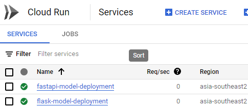
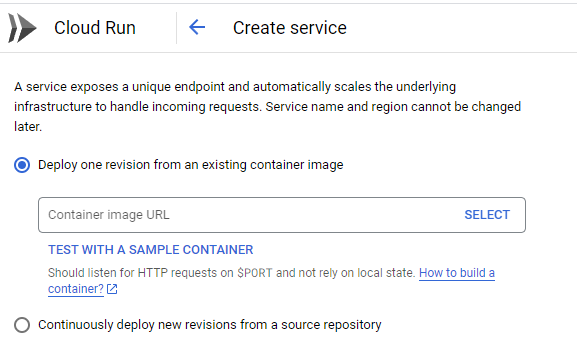
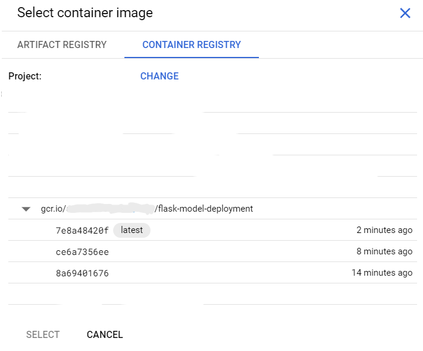
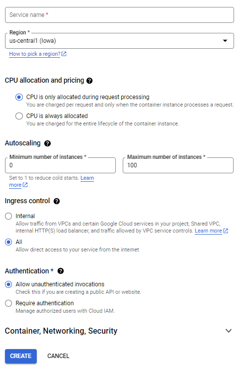
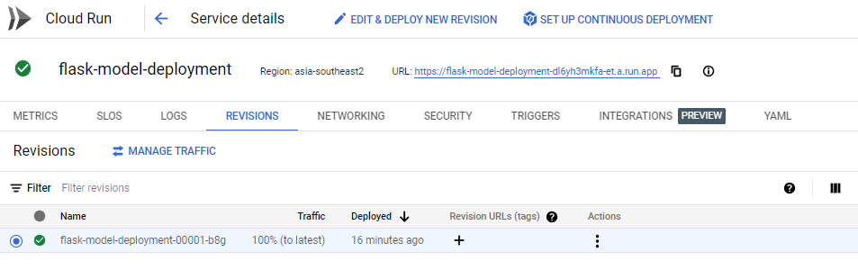
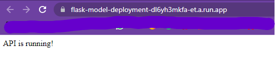
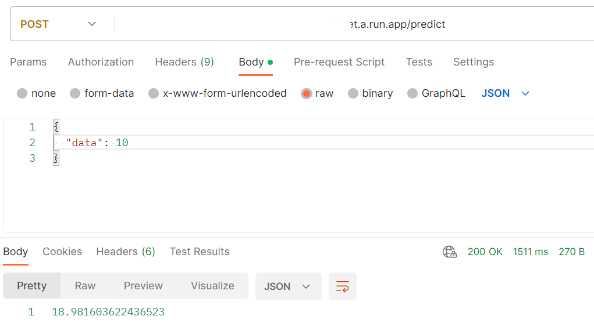

# Deploy Flask dengan menggunakan Cloud Run
Deploy Flask Machine Learning model dengan menggunakan CloudRun


## Kebutuhan
* Pyenv (optional)
* Virtualenv (optional)
* Python 3.9
* Google Cloud Platform Account
* Google Cloud Platform - API Cloud Build


## Jalankan secara lokal
```
$ python -m venv [nama-folder]
$ cd [nama-folder]
$ cd Scripts
$ activate
$ cd ..
$ git clone https://github.com/fikrimln16/flask-cloudrun-models-deployment
$ pip install -r requirements.txt
$ python main.py
```

## Cara deploy ke cloud-run menggunakan cloud SDK
```
$ gcloud init
$ gcloud services enable run.googleapis.com
$ gcloud builds submit --tag gcr.io/[project-id-kalian]/flask-model-deployment
$ gcloud run deploy --image gcr.io/[project-id-kalian]/flask-model-deployment --platform managed --region asia-southeast2 --allow-unauthenticated flask-model-ml
```

## Cara deploy ke cloud-run menggunakan Google Cloud Platform 

1. Pastikan Anda memiliki akun Google Cloud Platform (GCP) yang aktif. Jika belum, daftar dan buat proyek baru di https://console.cloud.google.com.

2. Pastikan Anda telah menginstal Google Cloud SDK (https://cloud.google.com/sdk) dan menginisialisasi dengan menjalankan perintah berikut di terminal atau command prompt:
   ``` gcloud init ```
 
3. Buatlah repository di layanan pengelolaan kode seperti GitHub atau GitLab, dan pastikan repository tersebut berisi semua file yang diperlukan untuk aplikasi Flask, termasuk Dockerfile, requirements.txt, dan kode aplikasi Flask Anda.

4. Buka terminal atau command prompt, lalu arahkan ke direktori tempat Anda ingin mengklon repository Flask.

5. Klone repository Flask dengan menjalankan perintah berikut:
   ` git clone https://github.com/fikrimln16/Flask-cloudrun-models-deployment `
 
 6. Setelah proses pengklonan selesai, arahkan terminal atau command prompt ke direktori Flask yang baru saja dikloning.
 
 7. Build container Docker lokal dengan menjalankan perintah berikut:
   ` docker build -t gcr.io/[PROJECT_ID]/Flask-app . `
    Ganti [PROJECT_ID] dengan ID proyek Google Cloud Platform yang telah Anda tentukan sebelumnya.
    
 8. Setelah proses pembangunan selesai, verifikasi bahwa kontainer Docker lokal berjalan dengan menjalankan perintah berikut:
    ` docker run -p 8080:8080 gcr.io/[PROJECT_ID]/flask-app `
    Pastikan tidak ada kesalahan dan aplikasi Flask berjalan dengan baik di localhost.

9. Jika langkah sebelumnya berhasil, berhenti dan hapus kontainer Docker yang berjalan dengan menekan Ctrl+C di terminal atau command prompt.

10. Untuk menerbitkan kontainer Docker ke Google Cloud Container Registry, jalankan perintah berikut:
    ` docker push gcr.io/[PROJECT_ID]/flask-app `
    Kontainer akan diunggah ke Container Registry di proyek Google Cloud Platform yang sesuai.
    
11. Selanjutnya, buat layanan Cloud Run dengan menjalankan perintah berikut pada asia-southeast2(jakarta): 
    ` gcloud run deploy --image gcr.io/[PROJECT_ID]/flask-model-deployment --platform managed --region asia-southeast2 --allow-unauthenticated flask-model-ml `
 
12. GCP akan meminta Anda untuk memilih wilayah (region) untuk mendeploy layanan Cloud Run. Pilih wilayah yang sesuai dengan kebutuhan Anda.

13. Setelah proses deploy selesai, GCP akan memberikan URL yang dapat digunakan untuk mengakses aplikasi Flask yang dideploy. Salin URL tersebut dari output dan coba akses di web browser atau dengan menggunakan      perangkat lunak pengujian API seperti Postman.


14. Jika cara 11 dan 12 tidak bisa, maka lakukan lah cara manual seperti ini setelah berhasil clone repo:
    `gcloud builds submit --tag gcr.io/[project-id-kalian]/flask-model-deployment`

15. Buka Cloud Run pada google cloud platform,

klik tombol create service

16. Pilih Deploy one revision from an existing container image, lalu tekan select


17. Pilih Container Registry, lalu pilih container image yang sudah kita buat sebelumnya pada poin 14


18. Lalu setting region sesuai kebutuhan anda, lalu tekan create


19. Jika sudah berhasil, maka tampilan akan seperti ini, dan tersedia url yang sudah diberikan


20. Setelah proses deploy selesai, GCP akan memberikan URL yang dapat digunakan untuk mengakses aplikasi Flask yang dideploy. Salin URL tersebut dari output dan coba akses di web browser atau dengan menggunakan      perangkat lunak pengujian API seperti Postman.



